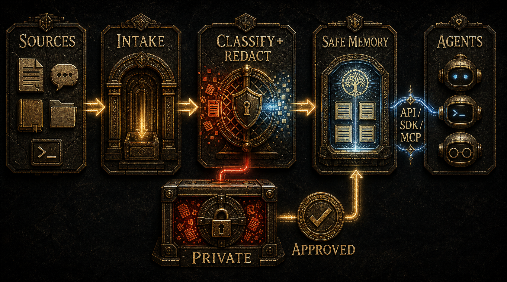

<p align="center">
  
</p>

<p align="center">
  <strong>AI 에이전트를 위한 직접 호스팅 가능한 공유 메모리 계층.</strong>
</p>

<p align="center">
  <a href="README.md">English</a> ·
  <a href="docs/installation.md">설치</a> ·
  <a href="docs/api.md">API</a> ·
  <a href="docs/agent-quickstart.md">에이전트 빠른 시작</a> ·
  <a href="docs/local-development.md">로컬 개발</a> ·
  <a href="docs/licensing.md">라이선스</a>
</p>

# Luthn

Luthn은 여러 AI 에이전트가 필요한 정보를 함께 참고할 수 있게 해주는 공유 기억
공간입니다.

모든 원본 자료와 비공개 기록을 AI의 기본 기억으로 넘기지 않는 것을 목표로
합니다.

기본 방향은 직접 관리입니다. 로컬 환경이나 PostgreSQL 같은 저장소에 정보를
두고, 정해진 규칙에 따라 정보를 분류합니다. 민감한 내용은 가리고, 사용 기록을
남기며, AI 에이전트가 안전하게 필요한 맥락만 가져갈 수 있도록 합니다.

## Luthn 철학

공유 기억은 실제로 도움이 되어야 합니다.
어떤 정보를 근거로 사용했는지 나중에 확인할 수 있어야 합니다.
그리고 AI가 볼 수 있는 정보와 볼 수 없는 정보의 경계가 분명해야 합니다.

에이전트는 사용이 허용된 정보만 받아야 합니다. 민감한 원문, 비공개 기록, 자격
증명, 실행 기록은 명확한 보호 규칙 안에서 관리되어야 합니다.

## 왜 Luthn인가

AI 에이전트는 프로젝트의 맥락을 기억하고 다시 사용할 수 있을 때 더
유용해집니다.

하지만 비공개 원본 데이터가 여러 에이전트와 세션에 그대로 복사되면 위험도 함께
커집니다.

Luthn은 이 문제를 나누어 다룹니다.

- 원본 자료와 비공개 기록은 기본 에이전트 메모리에서 제외합니다.
- 정책상 공유해도 되는 요약, 참조, 맥락 묶음만 에이전트에게 제공합니다.
- 어떤 정보가 사용됐고, 어떤 접근이 허용됐는지 기록으로 남깁니다.
- 사용자가 직접 관리하는 인프라 안에서 정보의 경계를 운영합니다.

## 동작 방식

<p align="center">
  
</p>

```text
원본 자료
  -> 수집
  -> 분류와 정책 적용
  -> 민감한 내용 가림 및 검토
  -> 공유 메모리, 위키용 Markdown, 맥락 묶음 생성
  -> 에이전트 API와 MCP 도구를 통해 제공
```

에이전트가 기본으로 보는 정보는 안전하게 정리된 결과물입니다. Luthn은
내부적으로 민감한 기록을 보관하고 활용할 수 있지만, 기본 API와 MCP 경로에서는
에이전트가 원본 저장소나 원문 전체에 직접 접근하지 않도록 합니다.

## 빠른 시작

### [권장] Docker 설치

Docker Compose를 포함한 Docker가 필요합니다.

```bash
curl -fsSL https://raw.githubusercontent.com/JakobSung/Luthn/main/scripts/install.sh | bash -s -- --connect-codex
```

이 한 명령이 Luthn 설치와 Codex connector 등록을 진행합니다. 마지막에 출력되는
Codex 재시작 및 `/hooks` Trust 단계는 사용자 확인이 필요한 보안 절차입니다.

### [선택] 에이전트에게 시키기

Codex나 다른 코딩 에이전트에 아래 프롬프트를 전달하세요.

```text
다음 문서에 따라 Docker 방식으로 Luthn을 설치하세요.
https://raw.githubusercontent.com/JakobSung/Luthn/refs/heads/main/docs/installation.md

설치 상태를 검증하고 운영 콘솔 URL을 보여준 뒤 `luthn connect codex`로 Codex를
연결하세요. 서비스 토큰은 출력하지 마세요.
```

### 관리

```bash
luthn status
luthn update
luthn reset --yes
luthn uninstall
luthn uninstall --purge-data --yes
```

`update`는 대상 runtime을 받은 뒤 write path를 멈추고 PostgreSQL backup과
migration을 수행합니다. `reset`은 database와 operator volume을 삭제합니다.
일반 `uninstall`은 data, config, backup을 보존하고, 두 개의 파괴적 flag를
모두 지정한 purge만 전부 삭제합니다.

| 명령 | PostgreSQL·operator volume | 설정·토큰 | 백업 | CLI·runtime |
|---|---|---|---|---|
| `luthn update` | 보존 | 보존 | 새 백업 추가 | 갱신 |
| `luthn reset --yes` | 삭제 후 재생성 | 보존 | 보존 | 유지 |
| `luthn uninstall` | 보존 | 보존 | 보존 | 삭제 |
| `luthn uninstall --purge-data --yes` | 삭제 | 삭제 | 삭제 | 삭제 |

### 에이전트 연결

Codex는 한 명령으로 연결합니다.

```bash
luthn connect codex
```

새 작업이나 주제가 시작될 때 작은 context pack을 한 번만 조회하려면
`--auto-recall`을 추가합니다.

```bash
luthn connect codex --auto-recall
```

명령이 안내하는 순서대로 Codex를 재시작하고 `/hooks`에서
`Stop > luthn.agent-connector.v1`을 열어 **Trust**를 선택해야 연결이 완료됩니다.
한 턴을 마친 뒤 `automatic-ingestion`이 `Active`인지 확인합니다. 연결 상태 확인과
해제는 다음 명령을 사용합니다.

```bash
luthn connection status codex
luthn disconnect codex
```

하나의 설정 명령 내부에서는 두 경로가 분리되어 유지됩니다. Codex hook은 길이가
제한된 최종 응답 capsule을 분류가 적용되는 HTTP 수집 경로로 보내고, MCP는 모델이
판단하는 안전한 조회와 명시적 shared-memory write를 담당합니다. 기존의 다른
Codex hook과 MCP 등록은 보존하며 token은 Luthn private config에만 남습니다. 운영
콘솔은 에이전트 연결 상태만 읽기 전용으로 표시합니다.

현재 Host Connector는 Codex만 지원합니다. 같은 수명주기 계약을 사용하는 Claude
Code Connector와 공식 MemoryProvider를 사용하는 별도 Hermes 통합은 예정 기능이며
이 명령으로 아직 설치되지 않습니다. 소스 build, in-memory mode, 기여자 명령은
[로컬 개발](docs/local-development.md)에 남겨둡니다.

## 데이터 경계

에이전트용 안전한 공유 메모리에 포함될 수 있는 것:

- 검토된 요약
- 가림 처리된 원본 참조
- 비밀값이 없는 실행 절차와 구현 메모
- 정책상 허용된 프로젝트 메타데이터
- 안전하게 정리된 대화 결론

민감 저장소에 두어야 하는 것:

- 고객 또는 사용자 원문
- 비공개 이메일, 메시지, 계약, 견적, 회계, 결제 기록
- 자격 증명과 자격 증명이 포함된 운영 자료
- 가리지 않은 사고 로그
- 정책상 비공개인 기록

민감한 기록은 검토된 요약에 반영될 수 있지만, 에이전트의 기본 공유 메모리로
직접 노출되지 않습니다.

## 문서

- [설치와 수명주기](docs/installation.md)
- [API](docs/api.md)
- [에이전트 빠른 시작](docs/agent-quickstart.md)
- [로컬 개발](docs/local-development.md)
- [운영과 복구](docs/operations.md)
- [데이터 경계](docs/data-boundaries.md)
- [라이선스 모델](docs/licensing.md)

## 라이선스

Luthn은 컴포넌트별 라이선스 모델을 사용합니다.

| 컴포넌트 | 라이선스 |
|---|---|
| Core와 직접 호스팅 실행 환경 | AGPL-3.0-only |
| SDK, HTTP 연결기, 공개 플러그인 템플릿 | Apache-2.0 |

전체 패키지 경계는 [docs/licensing.md](docs/licensing.md)를 참고하세요.

## 기여

버그 신고와 기능 제안은 누구나 GitHub Issue로 등록할 수 있습니다. Pull request는
당분간 초대된 collaborator만 만들 수 있으므로 collaborator가 아니라면 Issue를
등록해 주세요. 현재 정책은 [CONTRIBUTING.md](CONTRIBUTING.md)를 참고하세요.

이 저장소는 공개 가능한 상태를 기본으로 유지해야 합니다. 자격 증명, 비공개 원본
기록, 고객 원문, 로컬 에이전트 산출물, 실행 증거, 로컬 계획 상태를 커밋하지
마세요.
