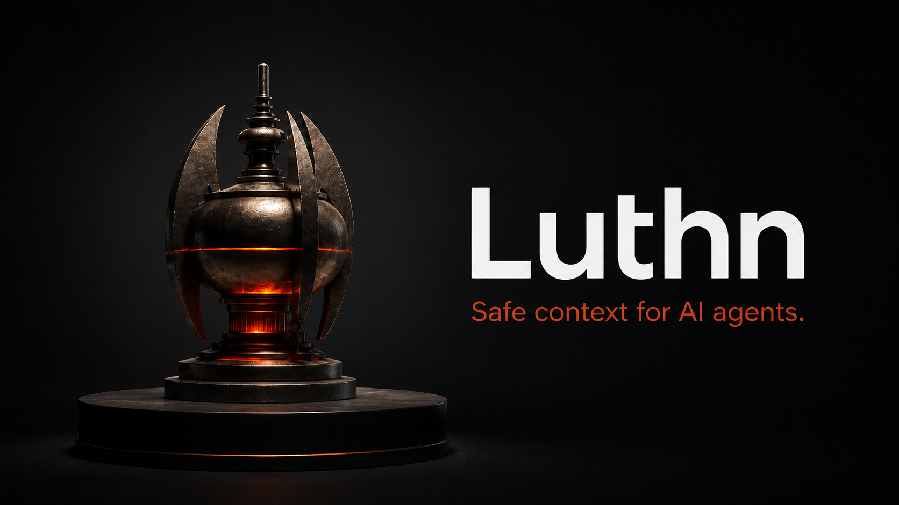

<p align="center">
  
</p>

<p align="center">
  <strong>Self-hosted shared memory for AI agents, with a clear data boundary.</strong>
</p>

<p align="center">
  <a href="README.ko.md">한국어</a> ·
  <a href="docs/installation.md">Installation</a> ·
  <a href="docs/agent-quickstart.md">Codex connection and memory</a> ·
  <a href="docs/data-boundaries.md">Data boundaries</a> ·
  <a href="docs/local-development.md">Development</a>
</p>

# Luthn

Luthn gives multiple AI agents a shared, reusable project memory without making
raw private data part of the model's default context.

- Run it in infrastructure you manage with Docker and PostgreSQL.
- Classify and redact intake before exposing agent-safe summaries and context.
- Audit what was stored, shared, and retrieved.

## How The Memory Loop Works

On macOS, Linux, and Windows, a trusted Codex hook can submit a bounded capsule
of the final assistant response after a turn. Luthn redacts and classifies that
capsule before anything becomes agent-visible. MCP provides safe reads and
explicit shared-memory writes.

Lightweight auto-recall fetches one small context pack when a new task or
material topic begins. It is enabled by default when Codex is connected and
reuses that context during the task instead of querying on every turn.

```text
completed turn -> bounded capsule -> classify and store safe context
new task       -> auto-recall or MCP -> reuse relevant context
```

See [Codex connection and memory](docs/agent-quickstart.md) for setup, the
one-time hook Trust step, privacy guarantees, and recall limits.

## Recommended Installation

Give Codex or another coding agent this prompt:

```text
Install and configure Luthn locally by following the instructions here:
https://raw.githubusercontent.com/JakobSung/Luthn/refs/heads/main/docs/installation.md
```

For requirements, manual installation, Windows setup, lifecycle commands, and
agent connections, see the [detailed installation guide](docs/installation.md).

## Data Boundary

Raw customer records, private messages, credentials, and unredacted operational
data stay behind the private boundary. Agents receive only policy-approved safe
projections such as reviewed summaries, redacted references, and approved
project context. External publication is a separate, explicit approval path.

Read [Data boundaries](docs/data-boundaries.md) for classification examples,
provider-transfer implications, agent visibility, and publication rules.

## Documentation

- [Installation, recovery, and lifecycle](docs/installation.md)
- [Codex connection, hook, MCP, and recall](docs/agent-quickstart.md)
- [Data boundaries](docs/data-boundaries.md)
- [Operations and recovery](docs/operations.md)
- [API](docs/api.md)
- [Architecture](docs/architecture.md)
- [Local development](docs/local-development.md)
- [Licensing](docs/licensing.md)

## License And Contributing

The self-host runtime is AGPL-3.0-only; SDKs, HTTP connectors, and public plugin
templates are Apache-2.0. See [Licensing](docs/licensing.md) for the package
boundary and [CONTRIBUTING.md](CONTRIBUTING.md) before proposing changes.
